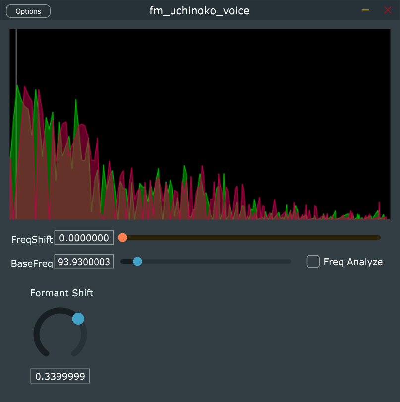

## fumi2kick vst3 plugin - 『うちのこボイス』

ボイチェンプラグインの自作を模索するプロジェクトです。

VST3 ホストで利用するか、スタンドアロンアプリを起動して使用します。
入力された音声を周波数シフトしたりフォルマントシフトすることができます。

当プラグイン単体での音声遅延時間は多分 43ms 位です。

JUCE ライブラリを使用しています。

# ライセンス

License is GPLv3

当プラグインのライセンスは GPLv3 です。
JUCE ライブラリにて GPLv3 の使用を選択して利用しています。

# ビルド方法

## 用意するもの

- JUCE ライブラリと projucer
- Visual Studio community 2019 (もしくはそれ以上)

## 手順

1. juce.com から projucer を含んだ JUCE ライブラリを入手します
2. projucer を起動してライブラリパス等の初期設定を行います
3. 当リポジトリをクローンします
4. 当リポジトリ内の `fm_uchinoko_voice.jucer` を projucer にて open します
5. projucer の export で Visual Studio 2019 を選択して "Save Project and Open IDE" を実行して build project を生成します
6. Visual Studio が起動するので、ソリューションをビルドします

# 使い方

- Formant Shift
  - 声を維持したまま全体的に高くしたり低くしたりします
- Frequency Shift
  - 声の高さを指定した周波数分だけスライドします
  - 今のところ低くはできません
- Base Frequency
  - 自分の声が持つ基底周波数を指定してください
  - Formant Shift に影響しますがそんなに変化は現れません 100Hz 固定でも良い位です
  - 自分の声の周波数を把握していない場合は "Base Analyze" を使って調べてみてください
- Base Analyze
  - チェックボックスに印を付けると、入力音声から基底周波数を検出します
  - あんまし精度良くありません、だいたいの値がわかったらオフにして "Base Frequency" を固定値で使うのがオススメです
  - オンにしたままだと声の抑揚に合わせて Formant Shift が変化するのでより良い変換になる、はずなのですがこの値での変化はほとんどわからないので気分程度です

## vst3 プラグイン

vst3 プラグインの配置場所にコピーしてください。

64bit Windows では `c:\Program Files\Common Files\VST3\` へコピーします。

## スタンドアロンアプリ

`fm_uchinoko_voice.exe` を起動します。

Option でオーディオデバイスとマイクデバイスを設定してください。

# 仕組み

入力音声を FFT で周波数成分に分解し、周波数成分をシフトした後 iFFT で音声信号に戻しています。

FFT 変換した音声を色々加工して楽しむための実験コードとなります。

# credit

## author

- rerofumi (@rerofumi, @hesui_channel)

## update

- Feb.19.2021 / Ver0.1.0
  - 動作するようになったのでリリース
